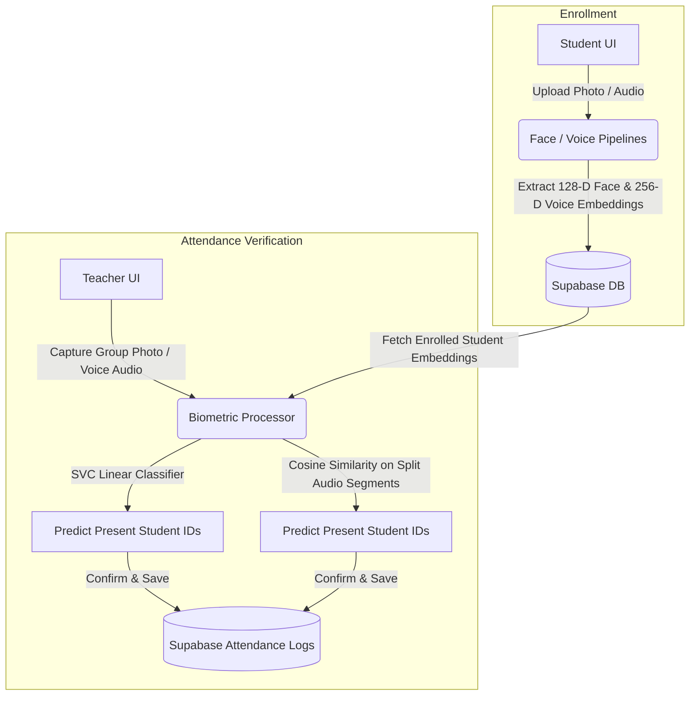

# 🎓 IntelliPresenceSync (AI-Powered Smart Attendance Platform)

[](https://intellipresencesync-mihirlegacy.streamlit.app/)
[](https://www.python.org/)
[](https://supabase.com/)
[](#)

**IntelliPresenceSync** is an enterprise-grade, AI-driven attendance tracking and synchronization web application. Designed to replace traditional roll calls, it leverages advanced **computer vision** for facial recognition and **deep learning audio analysis** for speaker identification to log student attendance seamlessly. 

The entire system integrates with **Supabase (PostgreSQL)**, runs a secure custom light-theme styling system immune to browser dark-mode distortions, and is fully responsive on mobile devices.

---

## 🚀 Key Features

*   **Dual-Biometric Verification:** Supports both photo-based facial validation and voice-signature identification.
*   **Face Recognition Pipeline:** Captures classroom pictures, extracts face encodings using `dlib` (128-D vectors), and runs an in-memory support vector machine (`SVM`) classifier trained on enrolled student profiles.
*   **Voice Verification & Bulk Auditing:** Uses `resemblyzer` (deep speaker embedding encoder) and `librosa` to extract 256-dimensional voiceprints. Features silence-based segment splitting (`librosa.effects.split`) to automatically recognize multiple speakers speaking in sequence from a single bulk classroom audio recording.
*   **Aesthetic & Color Stabilization System:** Custom CSS bindings lock the UI to a premium cream layout. Built-in `color-scheme` blockades prevent browser automatic dark-mode plugins from breaking input fields, labels, buttons, dialog boxes, and toaster notifications.
*   **Timezone Consistency:** Natively reads, parses, logs, and groups records in **Indian Standard Time (IST)**, eliminating timezone shift issues when deployed on global cloud servers.

---

## 🛠️ Technology Stack

| Category | Technologies / Libraries Used |
| :--- | :--- |
| **Frontend & UI** | [Streamlit](https://streamlit.io/) (v1.60+), Custom Vanilla CSS, HTML5, Google Fonts |
| **Database & Auth** | [Supabase](https://supabase.com/) (PostgreSQL), `bcrypt` (Secure Credential Hashing) |
| **Computer Vision** | `dlib` (Frontal Face Detector & Shape Predictor), `face_recognition_models` (128-D embeddings), `scikit-learn` (SVC Linear Classifier) |
| **Audio Processing** | `resemblyzer` (Deep Speaker Embedding Encoder), `librosa` (WAV preprocessing, Silence Detection, Waveform Splitting) |
| **Utilities & Assets**| `segno` (Dynamic QR Code Generation), `pillow` (Image Manipulation), `httpx` / `ssl` |

---

## 📂 Folder Structure

The project follows a modular, separation-of-concerns pattern:

```directory
IntelliPresenceSync/
├── .streamlit/
│   └── config.toml          # Streamlit theme locking configuration
├── src/
│   ├── components/          # Reusable UI modals and dialog elements
│   │   ├── dialog_add_photo.py       # Modal for capturing student registration photos
│   │   ├── dialog_attendance_result.py# Dialog confirming recognized attendance entries
│   │   ├── dialog_auto_enroll.py     # Classroom QR-code auto enrollment confirm modal
│   │   ├── dialog_create_subject.py  # Modal for teachers to define new courses
│   │   ├── dialog_enroll.py          # Modal for manual student class enrollments
│   │   ├── dialog_share_subject.py   # Modal showing course enrollment QR codes
│   │   ├── dialog_voice_attendance.py# Voice-record capture and comparison modal
│   │   ├── footer.py                 # Responsive footer layouts
│   │   ├── header.py                 # Header containing home navigation links
│   │   └── subject_card.py           # Custom cards representing student courses
│   ├── database/            # Supabase postgres handlers and utilities
│   │   ├── config.py                 # Supabase client setup
│   │   └── db.py                     # CRUD database functions (students, subjects, logs)
│   ├── pipelines/           # AI Core Models
│   │   ├── face_pipeline.py          # Facial extraction (dlib) + SVM classifier
│   │   └── voice_pipeline.py         # Voice pre-processing (librosa) + speaker identification (resemblyzer)
│   ├── screens/             # Primary Application Views
│   │   ├── home_screen.py            # Welcome portal with role selector (Teacher/Student)
│   │   ├── student_screen.py         # Student dashboard (registration, course enrollments)
│   │   └── teacher_screen.py         # Teacher dashboard (course manager, attendance reports, logs)
│   └── ui/                  # Global styling system
│       └── base_layout.py            # CSS overrides, colors, responsive media queries
├── app.py                   # Main entry point of the Streamlit application
├── requirements.txt         # Production dependency list
└── README.md                # Project documentation
```

---

## ⚙️ Architecture & Data Flow



### 1. Registration Flow
1. **Student Registration:** Students sign up, select their subject, and submit a photo + voice recording.
2. **Feature Extraction:**
    *   **Face:** `dlib` detects the face area, maps landmark locations, and computes a 128-dimensional vector descriptor.
    *   **Voice:** `librosa` loads the WAV data, normalizes it via `resemblyzer` preprocessing, and generates a 256-dimensional voice embedding.
3. **Database Storage:** The embeddings are saved as float arrays directly in PostgreSQL tables on Supabase.

### 2. Validation Flow
1. **Classroom Scanning:** 
    *   **Face:** The teacher uploads a group photo. The SVM model dynamically retrieves all student embeddings from the database, fits an in-memory classifier, and maps each recognized face in the photo to a student profile.
    *   **Voice:** The teacher records a sequence of student voice check-ins. The audio stream is split by silence thresholds (`top_db=30`). The individual segments are mapped to the enrolled voice prints using dot-product cosine similarity.
2. **IST Logging:** Validated present students are logged with a standardized timezone-aware IST ISO timestamp.

---

## 💅 Styling and Responsive Design System

The application applies sophisticated custom styling overrides inside `base_layout.py` to deliver a premium user experience:
*   **Warm Palette:** Pure white card surfaces (`#FFFFFF`) overlaying a warm cream background (`#FEF5E7`) with dark gold accents (`#e8b582`) and deep navy text (`#081c36`).
*   **Anti-Color Distortion:** Employs high-specificity selectors to lock dark text colors on paragraphs, input fields, labels, buttons, sidebars, toast notifications, expanders, and dividers.
*   **Browser Auto-Dark Mode Immunity:** Applies `color-scheme: light !important` overrides to all inputs. This protects visual integrity from Google Chrome or Brave automatic dark inversion plugins, keeping text visible and eye toggles transparent.
*   **Mobile-Fluid layout:** Under screen widths of `768px`, typography fonts scale down, buttons stretch to `100%` width, and stacked card columns obtain responsive margins/paddings.

---

## 💻 Getting Started Locally

### Prerequisites
*   Python **3.10** or **3.11** (Highly recommended. Higher versions like 3.13/3.14 do not have pre-compiled wheels for scientific compilation libraries like `numba` and `dlib`).
*   Git

### Installation
1.  **Clone the Repository:**
    ```bash
    git clone https://github.com/mihirgupta665/IntelliPresenceSync.git
    cd IntelliPresenceSync
    ```
2.  **Create and Activate a Virtual Environment:**
    ```bash
    python -m venv venv
    # Windows:
    .\venv\Scripts\activate
    # macOS/Linux:
    source venv/bin/activate
    ```
3.  **Install Dependencies:**
    ```bash
    pip install -r requirements.txt
    ```
4.  **Configure Environment Variables:**
    Create a `.env` file or set database credentials for Supabase:
    ```env
    SUPABASE_URL="https://your-supabase-url.supabase.co"
    SUPABASE_KEY="your-supabase-anon-key"
    ```
5.  **Run the Application:**
    ```bash
    python -m streamlit run app.py
    ```

---

## 👥 Author
*   **Mihir Gupta** - [GitHub Profile](https://github.com/mihirgupta665)
